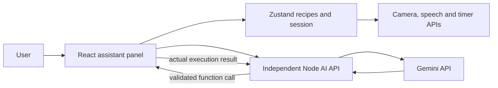

# Architecture

PalmChef is a React 18, TypeScript, Vite, Tailwind application. React Router owns pages. Zustand persists recipes, cooking session, user profile and settings in localStorage. `Assistant.tsx` binds the current recipe and step to MediaPipe hand gestures, browser speech synthesis and the timer. PDF input uses `pdfjs-dist` locally. URL input stores a link as a recipe step. The service worker caches static assets and HTML for offline use.

The existing `server/index.js` has authentication and recipe parsing endpoints and requires MongoDB at startup. The current Dockerfile serves only the static frontend with Nginx; it does not start that server. The new `server/ai` service is separate so it can keep the key private without changing the live static image or Mongo requirement. `vite.config.ts` routes `/api/ai` to it during local development. Production wiring requires an explicitly deployed service and frontend base URL or reverse proxy.

Timer countdown is now calculated from a persisted end timestamp in the existing session store; the timer display and AI tool read the same state. MediaPipe gesture mapping is unchanged. Step changes reset the per-step timer and trigger existing narration. Recipe additions use the existing persisted recipe store, preserving the original on AI modification.
